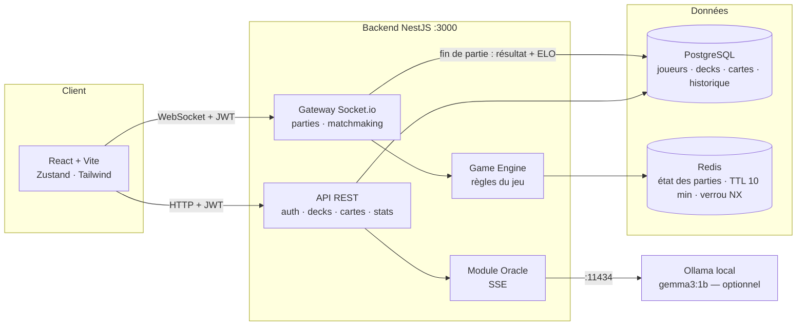

# Olympos Card Clash

Jeu de cartes stratégique 1v1 inspiré de la mythologie grecque. Construis ton deck de 30 cartes, invoque des dieux et des héros, lance des sorts dévastateurs, et réduis les 20 PV de ton adversaire à zéro.

---

## Stack technique

| Couche | Technologies |
|--------|-------------|
| Backend | NestJS · Prisma · PostgreSQL · Redis · Socket.io · JWT |
| Frontend | React 18 · TypeScript · Zustand · Framer Motion · Tailwind CSS · Vite |
| IA (Oracle) | Ollama · Gemma 3:1B (optionnel) |

---

## Livrables du module

| Livrable | Emplacement |
|----------|-------------|
| Document de cadrage (intention, wireframes, MCD/MLD/MPD, stack, IA) | [`docs/aime-enzo-m2-dev-ynov-connect-olympos-v2.pdf`](docs/aime-enzo-m2-dev-ynov-connect-olympos-v2.pdf) |
| Grille d'évaluation officielle du module | [`docs/Document de cadrage - Coord dev Front  Back - M2 DEV-F YC.md`](docs/Document%20de%20cadrage%20-%20Coord%20dev%20Front%20%20Back%20-%20M2%20DEV-F%20YC.md) |
| Doc technique & déploiement | ce README |
| Rapport d'audit (Activité 8) | [`docs/RAPPORT_AUDIT.md`](docs/RAPPORT_AUDIT.md) |
| Analyse critique & feuille de route (Activité 10) | [`docs/ANALYSE_CRITIQUE.md`](docs/ANALYSE_CRITIQUE.md) |
| Détail des activités du module (énoncés) | [`docs/Activité.md`](docs/Activité.md) |
| Guide de jeu (règles détaillées, joueur) | [`docs/GAME_GUIDE.md`](docs/GAME_GUIDE.md) |
| Wireframes & design system | [`design/`](design/) — voir [`design/aura_of_olympus/DESIGN.md`](design/aura_of_olympus/DESIGN.md) |
| Prompts de génération des illustrations de cartes | [`design/CARD_PROMPTS.md`](design/CARD_PROMPTS.md) |

---

## Installation & Lancement (de zéro)

### Prérequis

| Outil | Version | Rôle |
|-------|---------|------|
| Node.js | 20+ | Backend & frontend |
| Docker + Docker Compose | — | PostgreSQL 15 + Redis 7 (recommandé) |
| [Ollama](https://ollama.com) | optionnel | Oracle IA (modèle `gemma3:1b`) |

> Sans Docker : installer PostgreSQL 15 (créer une base `olympos`) et Redis 7 manuellement, puis adapter `DATABASE_URL` et `REDIS_URL` dans `backend/.env`.

### 1. Cloner et lancer les services

```bash
git clone https://github.com/Enzo91080/olympos.git
cd olympos
docker compose up -d        # PostgreSQL sur :5432, Redis sur :6379
```

Identifiants PostgreSQL du docker-compose : user `postgres` / password `postgres` / base `olympos`.

### 2. Backend

```bash
cd backend
npm install
cp .env.example .env        # les valeurs par défaut fonctionnent avec le docker-compose
npx prisma migrate dev      # crée les tables
npx prisma db seed          # peuple les 37 cartes + comptes bot et admin
npm run start:dev           # → http://localhost:3000
```

### 3. Frontend

```bash
cd frontend
npm install
cp .env.example .env        # pointe vers localhost:3000 par défaut
npm run dev                 # → http://localhost:5173
```

### 4. (Optionnel) Oracle IA

```bash
ollama pull gemma3:1b       # puis laisser Ollama tourner (port 11434 par défaut)
```

Sans Ollama, l'Oracle renvoie une erreur 503 explicite — tout le reste du jeu fonctionne.

### 5. Vérifier

Ouvrir http://localhost:5173, créer un compte, un deck de démarrage est généré automatiquement → lancer une partie solo contre le bot.

### Comptes créés par le seed

| Compte | Identifiants | Usage |
|--------|--------------|-------|
| Admin | `admin@olympos.internal` / `admin123` | Page `/admin` (gestion joueurs, cartes, parties, audit log) |
| Bot | `bot@olympos.internal` | Adversaire du mode solo (connexion impossible) |

> ⚠️ Identifiants de développement uniquement — à changer avant tout déploiement public.

---

## Variables d'environnement

Les deux fichiers `.env.example` (backend et frontend) sont commités et documentés ; les `.env` réels sont ignorés par git.

### `backend/.env`

| Variable | Obligatoire | Description |
|----------|-------------|-------------|
| `DATABASE_URL` | ✅ | Connexion PostgreSQL (défaut aligné sur le docker-compose) |
| `REDIS_URL` | ✅ | Connexion Redis (état des parties en cours) |
| `JWT_SECRET` | ✅ | Secret de signature des tokens — à générer, ne pas garder la valeur d'exemple |
| `JWT_EXPIRES_IN` | ✅ | Durée de vie du token (défaut `7d`) |
| `PORT` | ✅ | Port de l'API (défaut `3000`) |
| `SMTP_HOST/PORT/USER/PASS/FROM` | ❌ | Envoi des emails "mot de passe oublié". Sans ces valeurs, le lien s'affiche dans la console backend. Pour Gmail : utiliser un [mot de passe d'application](https://myaccount.google.com/apppasswords) |
| `FRONTEND_URL` | ✅ | URL du front, utilisée dans les liens des emails |

L'Oracle n'a pas de variable : le backend appelle Ollama sur son URL par défaut (`http://localhost:11434`).

### `frontend/.env`

| Variable | Description |
|----------|-------------|
| `VITE_API_URL` | URL de l'API REST (défaut `http://localhost:3000`) |
| `VITE_WS_URL` | URL du serveur WebSocket (même backend) |
| `VITE_USE_MOCK` | `true` = données mockées sans backend, `false` = API réelle |

---

## Fonctionnalités

| Fonctionnalité | Description |
|----------------|-------------|
| Compte joueur | Inscription · Connexion · Mot de passe oublié (email) · Édition du profil (username, avatar) |
| Construction de deck | Multi-decks · Validation automatique · Auto-starter deck |
| Mode Solo | Partie contre un bot (IA locale) |
| Mode PvP | Matchmaking automatique ELO ±200 |
| Classement | 6 rangs ELO de Bronze à Légende |
| Historique | Journal de toutes les parties jouées |
| Oracle IA | Assistant stratégique en temps réel (Ollama requis) |
| Administration | Page `/admin` : gestion des joueurs (ban, rôles), des cartes, des parties, journal d'audit |

---

## Architecture



- L'état de chaque partie est stocké dans Redis avec un TTL de **10 minutes**.
- Un verrou Redis (SET NX) garantit qu'aucune action concurrente ne corrompt l'état.
- En fin de partie, l'état Redis est supprimé et le résultat est persisté en base.

---

## Rangs ELO

| Rang | ELO requis | Couleur |
|------|-----------|---------|
| Bronze | < 1 200 | Orange |
| Argent | 1 200 – 1 399 | Gris |
| Or | 1 400 – 1 599 | Jaune |
| Platine | 1 600 – 1 799 | Cyan |
| Diamant | 1 800 – 1 999 | Bleu |
| Légende | 2 000+ | Or brillant |

---

---

# Règles du jeu

## Objectif

Réduire les **20 PV** de l'adversaire à zéro. Le premier joueur dont les PV atteignent 0 perd.

---

## Déroulement d'une partie

### Mise en place

- Chaque joueur commence avec **20 PV** et **4 cartes en main**.
- Les decks sont mélangés aléatoirement avant la partie.
- Le joueur 1 joue en premier.
- Les deux joueurs commencent avec **0 mana** (le mana augmente en début de tour).

### Structure d'un tour

À chaque tour, dans l'ordre :

**1. Début de tour (automatique)**

| Étape | Détail |
|-------|--------|
| Mana max +1 | Augmente de 1 (plafonné à 10) |
| Mana rechargé | Le mana courant est remis au maximum |
| Pioche | 1 carte tirée du deck (voir Overdraw) |
| Réveil des créatures | Toutes les créatures alliées peuvent attaquer |

**2. Phase principale (actions libres)**

Le joueur actif peut, dans n'importe quel ordre et autant de fois que son mana le permet :
- Jouer des cartes de sa main
- Attaquer avec ses créatures

**3. Fin de tour**

Le joueur clique "Fin de tour". Le tour passe à l'adversaire.

---

## Mécaniques clés

### Maladie d'invocation (Summoning Sickness)

Une créature posée sur le terrain **ne peut pas attaquer le tour où elle arrive**. Elle peut attaquer à partir du tour suivant.

### Taunt implicite

Il est **interdit d'attaquer le héros adverse** tant qu'il reste des créatures sur son terrain. Toutes ses créatures doivent être détruites avant de pouvoir l'attaquer directement.

### Overdraw

Si ta main contient déjà **10 cartes** quand tu dois piocher, la carte piochée est **détruite sans effet**. Gérer la taille de sa main est stratégique.

### Plafond de soin

Les soins ne peuvent pas faire dépasser **20 PV**. L'excédent est perdu.

### Mana

- Le mana inutilisé est **perdu en fin de tour** (pas de banking).
- Le mana repart de zéro à chaque tour et est rechargé intégralement.

---

## Cartes

### Types de cartes

| Type | Description |
|------|-------------|
| **Créature** | Se place sur le terrain. Peut attaquer ou défendre. Possède ATK et DEF. |
| **Sort** | Effet instantané consommé dès le jeu (dégâts, soin, invocation). |
| **Artefact** | Équipement ou soin pour le joueur allié. |

### Statistiques

| Stat | Signification |
|------|--------------|
| **Coût** | Mana nécessaire pour jouer la carte |
| **ATK** | Dégâts infligés lors d'une attaque |
| **DEF** | Points de vie de la créature (meurt si DEF ≤ 0) |

### Ciblage des sorts et artefacts

| Type de ciblage | Comportement |
|-----------------|-------------|
| `targeted` | Tu choisis une créature ennemie **OU** le héros adverse |
| `targeted_creature` | Tu choisis une créature ennemie uniquement |
| `aoe_enemy` | Touche **toutes** les créatures ennemies automatiquement |
| `self` | S'applique au joueur (soin) ou à toutes ses créatures (buff DEF) |
| `summon` | Invoque une nouvelle créature sur ton terrain |
| `equip` | Buff une créature alliée (ATK/DEF) — **solo uniquement** |

---

## Combat

### Créature contre créature

Les dégâts sont **symétriques** : chaque créature inflige son ATK à la DEF de l'autre simultanément.

```
Exemple : Soldat Spartiate (1/2) attaque Satyre des Bois (2/2)
  → Satyre perd 1 DEF → DEF 1 (survit)
  → Soldat perd 2 DEF → DEF 0 (meurt)
```

Toute créature dont la DEF tombe à **0 ou moins** est immédiatement retirée du terrain.

### Créature contre héros

Une créature peut attaquer le héros adverse **uniquement si le terrain adverse est vide** (taunt implicite).

```
Exemple : Fantôme des Enfers (2/1) attaque le héros adverse
  → Héros adverse perd 2 PV (20 → 18)
  → Le Fantôme ne reçoit rien
```

### Après une attaque

La créature attaquante passe en état "a déjà attaqué" (`canAttack: false`) et ne peut plus attaquer ce tour.

---

## Construction de deck

| Règle | Valeur |
|-------|--------|
| Taille exacte pour jouer | **30 cartes** |
| Copies maximum par carte | **2** |
| Types de cartes autorisés | Tous (créatures, sorts, artefacts) |
| Cartes "Equip" en PvP | **Interdites** (solo uniquement) |

Un deck devient "valide" (jouable) dès qu'il contient exactement 30 cartes. La modification d'un deck revalide automatiquement son statut.

---

## Modes de jeu

### Solo (vs Bot)

| Paramètre | Joueur | Bot |
|-----------|--------|-----|
| PV de départ | 25 | 15 |
| Mana de départ | 1 | 0 |
| Comportement | Manuel | Automatique |

Le bot joue des créatures et attaque avec une logique déterministe simplifiée. Il est conçu pour être un adversaire d'entraînement accessible.

### PvP (vs Joueur)

| Paramètre | Joueur 1 | Joueur 2 |
|-----------|----------|----------|
| PV de départ | 20 | 20 |
| Mana de départ | 0 | 0 |
| Cartes Equip | Non supportées | Non supportées |

Le matchmaking recherche un adversaire dans une fourchette ELO de **±200 points**. Une fois les deux joueurs appariés, la partie démarre automatiquement.

---

## Victoire & Défaite

| Condition | Résultat |
|-----------|---------|
| PV de l'adversaire = 0 | Victoire |
| Mes PV = 0 | Défaite |
| Bouton "Abandonner" | Défaite (l'adversaire gagne) |
| Déconnexion en cours de partie | L'adversaire gagne automatiquement |
| Inactivité > 10 minutes | L'adversaire gagne (timeout Redis) |

---

---

# Cartes — Référence complète

> **Note :** Les textes d'effet décrivent le thème et le lore de la carte. En partie, les effets mécaniques appliqués sont ceux décrits dans la colonne "Effet mécanique" ci-dessous.

---

## Créatures

### Légendaires

| Carte | Coût | ATK | DEF | Effet mécanique |
|-------|------|-----|-----|-----------------|
| Zeus, Roi des Dieux | 8 | 9 | 7 | Créature standard 9/7 |
| Athena, Déesse de la Sagesse | 7 | 6 | 9 | Créature standard 6/9 |
| Poséidon, Maître des Mers | 7 | 7 | 7 | Créature standard 7/7 |
| Hadès, Seigneur des Enfers | 8 | 8 | 6 | Créature standard 8/6 |

### Épiques

| Carte | Coût | ATK | DEF | Effet mécanique |
|-------|------|-----|-----|-----------------|
| Hercule le Demi-Dieu | 6 | 8 | 5 | Créature standard 8/5 |
| Méduse la Gorgone | 5 | 6 | 4 | Créature standard 6/4 |
| Achille aux Pieds Légers | 5 | 7 | 3 | Créature standard 7/3 |
| Minotaure du Labyrinthe | 5 | 7 | 5 | Créature standard 7/5 |
| Hydre de Lerne | 6 | 5 | 6 | Créature standard 5/6 |

### Rares

| Carte | Coût | ATK | DEF | Effet mécanique |
|-------|------|-----|-----|-----------------|
| Pégase Ailé | 4 | 4 | 3 | Créature standard 4/3 |
| Cyclope de Sicile | 4 | 6 | 2 | Créature standard 6/2 |
| Centaure Chiron | 3 | 3 | 4 | Créature standard 3/4 |
| Sphinx de Thèbes | 4 | 4 | 4 | Créature standard 4/4 |
| Gorgone Sthéno | 3 | 3 | 3 | Créature standard 3/3 |
| Harpie du Vent | 3 | 4 | 2 | Créature standard 4/2 |

### Communes

| Carte | Coût | ATK | DEF | Effet mécanique |
|-------|------|-----|-----|-----------------|
| Soldat Spartiate | 1 | 1 | 2 | Créature standard 1/2 |
| Archer Athénien | 2 | 2 | 1 | Créature standard 2/1 |
| Satyre des Bois | 2 | 2 | 2 | Créature standard 2/2 |
| Nymphe Aquatique | 2 | 1 | 3 | Créature standard 1/3 |
| Fantôme des Enfers | 1 | 2 | 1 | Créature standard 2/1 |

---

## Sorts

### Légendaires

| Carte | Coût | Puissance | Ciblage | Effet mécanique |
|-------|------|-----------|---------|-----------------|
| Foudre de l'Olympe | 7 | 7 | `targeted` | Inflige 7 dégâts à une créature ou au héros adverse |

### Épiques

| Carte | Coût | Puissance | Ciblage | Effet mécanique |
|-------|------|-----------|---------|-----------------|
| Colère de Poséidon | 5 | 3 | `aoe_enemy` | Inflige 3 dégâts à toutes les créatures ennemies |
| Malédiction d'Hadès | 4 | 3 | `aoe_enemy` | Inflige 3 dégâts à toutes les créatures ennemies |

### Rares

| Carte | Coût | Puissance | Ciblage | Effet mécanique |
|-------|------|-----------|---------|-----------------|
| Bénédiction d'Athena | 3 | +3 PV | `self` | Soigne 3 PV au joueur (max 20) |
| Flèche d'Apollon | 2 | 3 | `targeted_creature` | Inflige 3 dégâts à une créature ennemie ciblée |
| Brume du Styx | 3 | 2 | `aoe_enemy` | Inflige 2 dégâts à toutes les créatures ennemies |

### Communes

| Carte | Coût | Puissance | Ciblage | Effet mécanique |
|-------|------|-----------|---------|-----------------|
| Frappe Divine | 1 | 2 | `targeted_creature` | Inflige 2 dégâts à une créature ennemie ciblée |
| Soin des Muses | 2 | +4 PV | `self` | Soigne 4 PV au joueur (max 20) |
| Invocation Mineure | 1 | — | `summon` | Invoque un Soldat Spartiate (1/2) sur le terrain |

---

## Artefacts

> Les artefacts de type `equip` (Trident, Casque, Sandales, Bouclier) sont **utilisables en mode solo uniquement**. En PvP, les jouer renvoie une erreur.

### Légendaires

| Carte | Coût | Bonus | Ciblage | Effet mécanique |
|-------|------|-------|---------|-----------------|
| Égide d'Athena | 6 | +2 DEF | `self` | Toutes les créatures alliées gagnent +2 DEF |

### Épiques

| Carte | Coût | Bonus | Ciblage | Effet mécanique |
|-------|------|-------|---------|-----------------|
| Trident de Poséidon | 5 | +3 ATK | `equip` | Une créature alliée gagne +3 ATK (solo) |
| Casque d'Hadès | 4 | +2 ATK / +2 DEF | `equip` | Une créature alliée gagne +2 ATK et +2 DEF (solo) |

### Rares

| Carte | Coût | Bonus | Ciblage | Effet mécanique |
|-------|------|-------|---------|-----------------|
| Sandales d'Hermès | 3 | +2 ATK | `equip` | Une créature alliée gagne +2 ATK (solo) |
| Lyre d'Orphée | 3 | +2 PV | `self` | Soigne 2 PV au joueur (max 20) |
| Bouclier de Persée | 2 | +3 DEF | `equip` | Une créature alliée gagne +3 DEF (solo) |

### Communes

| Carte | Coût | Bonus | Ciblage | Effet mécanique |
|-------|------|-------|---------|-----------------|
| Amulette d'Héra | 1 | +2 PV | `self` | Soigne 2 PV au joueur (max 20) |
| Torche de Prométhée | 2 | 1 | `aoe_enemy` | Inflige 1 dégât à toutes les créatures ennemies |

---

---

# API WebSocket — Événements

## Événements envoyés par le client

| Événement | Payload | Description |
|-----------|---------|-------------|
| `join_game` | `{ gameId }` | Rejoindre une salle de jeu |
| `play_card` | `{ gameId, cardId }` | Jouer une créature ou un sort auto |
| `play_card` | `{ gameId, cardId, targetId, targetType }` | Jouer un sort ciblé |
| `attack` | `{ gameId, attackerInstanceId, targetType, targetInstanceId? }` | Attaquer une créature ou le héros |
| `end_turn` | `{ gameId }` | Terminer son tour |
| `surrender` | `{ gameId }` | Abandonner la partie |
| `join_matchmaking` | `{ deckId }` | Rejoindre la file d'attente PvP |
| `leave_matchmaking` | `{}` | Quitter la file d'attente |

## Événements reçus par le client

| Événement | Payload | Description |
|-----------|---------|-------------|
| `game_state` | `GameState` | Nouvel état complet de la partie |
| `game_over` | `{ winnerId, reason }` | Fin de partie |
| `matchmaking:waiting` | — | En attente d'un adversaire |
| `matchmaking:matched` | `{ gameId, opponentId, ... }` | Adversaire trouvé |
| `matchmaking:error` | `{ message }` | Erreur matchmaking |
| `error` | `{ message }` | Erreur d'action (règle violée) |

---

# API REST — Endpoints principaux

## Authentification

| Méthode | Route | Description |
|---------|-------|-------------|
| POST | `/auth/register` | Créer un compte |
| POST | `/auth/login` | Se connecter |
| POST | `/auth/forgot-password` | Demander un email de réinitialisation |
| POST | `/auth/reset-password` | Réinitialiser le mot de passe |

## Decks

| Méthode | Route | Description |
|---------|-------|-------------|
| GET | `/decks` | Lister ses decks |
| POST | `/decks` | Créer un deck |
| GET | `/decks/:id` | Détail d'un deck |
| PATCH | `/decks/:id` | Renommer un deck |
| DELETE | `/decks/:id` | Supprimer un deck |
| POST | `/decks/:id/cards` | Ajouter une carte |
| DELETE | `/decks/:id/cards/:cardId` | Retirer une carte |

## Cartes

| Méthode | Route | Description |
|---------|-------|-------------|
| GET | `/cards` | Lister toutes les cartes |
| GET | `/cards/:id` | Détail d'une carte |

## Joueur

| Méthode | Route | Description |
|---------|-------|-------------|
| GET | `/players/me` | Profil du joueur connecté |
| PATCH | `/players/me` | Modifier son profil |
| GET | `/players/leaderboard` | Classement général |

## Parties

| Méthode | Route | Description |
|---------|-------|-------------|
| POST | `/games` | Créer une partie PvP |
| POST | `/games/solo` | Créer une partie contre le bot |
| GET | `/games/history` | Historique de ses parties (50 dernières) |
| GET | `/games/:id` | Détail d'une partie |
| PATCH | `/games/:id/finish` | Clore une partie |

## Matchmaking

| Méthode | Route | Description |
|---------|-------|-------------|
| POST | `/matchmaking/join` | Rejoindre la file d'attente |
| DELETE | `/matchmaking/leave` | Quitter la file d'attente |

## Administration (rôle `admin` requis)

| Méthode | Route | Description |
|---------|-------|-------------|
| GET | `/admin/stats` | Statistiques globales |
| GET / PATCH | `/admin/players`, `/admin/players/:id` | Lister, bannir, changer le rôle |
| GET / POST / PATCH / DELETE | `/admin/cards`, `/admin/cards/:id` | CRUD des cartes |
| GET / PATCH | `/admin/games`, `/admin/games/:id/abandon` | Lister, forcer l'abandon |
| GET | `/admin/audit-log` | Journal des actions admin |

## Oracle IA

| Méthode | Route | Description |
|---------|-------|-------------|
| POST | `/oracle/ask` | Poser une question à l'assistant (streaming SSE) |

---

# Codes d'erreur courants

| Code | Condition |
|------|-----------|
| 400 | Carte absente de la main |
| 400 | Mana insuffisant |
| 400 | Terrain plein (7 créatures max) |
| 400 | Créature ne peut pas attaquer (maladie d'invocation ou déjà attaqué) |
| 400 | Héros ciblé alors que des créatures adverses sont en jeu (taunt) |
| 400 | Sort ciblé sans préciser la cible |
| 400 | Deck invalide (≠ 30 cartes) |
| 400 | Action impossible dans l'état actuel (`waiting_players` ou `finished`) |
| 403 | Ce n'est pas ton tour |
| 403 | Joueur non participant à la partie |
| 410 | État de partie expiré (inactivité > 10 min) |
| 503 | Action concurrente en cours — réessayer dans un instant |

---

# Limites connues & pistes d'amélioration

## Limites actuelles

- **Bot solo déterministe** : le bot joue selon une logique simplifiée (pose la créature/le sort le moins cher jouable, attaque systématiquement) — il ne bluffe pas et ne planifie pas plusieurs coups à l'avance.
- **Pas de reprise multi-appareil** : la reconnexion (TTL Redis 10 min) fonctionne sur le même compte mais l'état de partie n'est pas notifié en push si l'onglet est fermé (pas de notifications navigateur).
- **Oracle dépendant d'Ollama local** : sans `ollama run gemma3:1b` lancé en local, la fonctionnalité IA renvoie une erreur 503 explicite plutôt qu'un fallback dégradé — pas de mode hors-ligne avec réponses pré-écrites.
- **Pas de tests end-to-end** : la couverture actuelle (`game.service.spec.ts`, `game-engine.service.spec.ts`) valide le moteur de jeu et la persistance Redis, mais il n'y a pas de tests d'intégration HTTP/WebSocket complets ni de tests frontend.
- **Modération absente** : aucun filtre sur les noms de joueurs/decks, pas de rate-limiting applicatif au-delà de la validation métier.
- **Fonctionnalités "Nice to have" non implémentées** : boutique de cartes (monnaie virtuelle) et mode spectateur, prévus dans le document de cadrage comme optionnels, n'ont pas été développés faute de temps.

## Pistes d'amélioration

- Ajouter une difficulté progressive au bot (heuristiques de ciblage, gestion de mana anticipée).
- Introduire un cache de réponses Oracle pour les questions fréquentes, en complément du streaming SSE.
- Ajouter des tests e2e (Supertest + client Socket.io mocké) pour couvrir le parcours matchmaking → partie → fin de partie.
- Implémenter le mode spectateur en réutilisant les rooms Socket.io existantes (lecture seule du `game_state`).
- Déployer réellement sur Railway (backend) et Vercel (frontend) tel que prévu dans le document de cadrage, actuellement le projet tourne uniquement en local.
